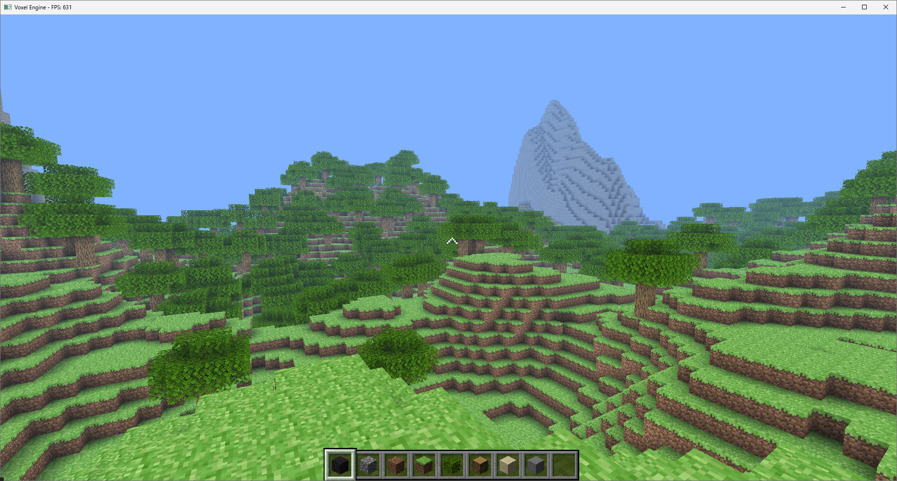
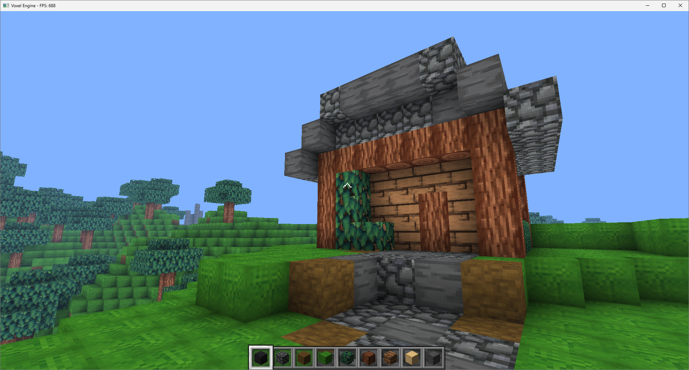
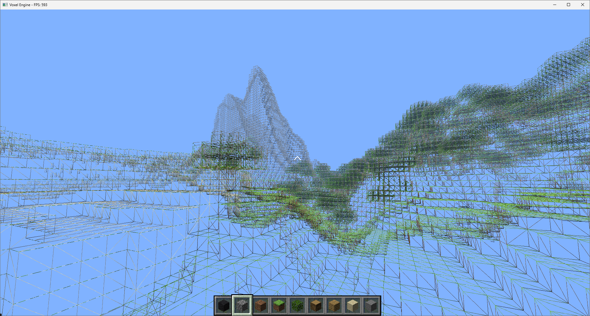

# Minicraft Voxel Engine

 

**Minicraft** is a voxel game engine built from scratch in **C#** using **OpenTK**. It features a custom Entity Component System (ECS), procedural terrain generation, and dynamic texture atlasing.

---

## Key Features

### 1. World Generation & Rendering

- **Procedural Terrain:** Infinite world generation using layered noise algorithms (Simplex) for height, temperature, and humidity.
- **Chunk System:** Optimized 16x16x256 chunk storage.
- **Face Culling:** Meshing algorithm that only renders visible surfaces to maximize FPS.
- **Frustum Culling:** Checks chunk bounding boxes against the camera view to skip rendering invisible geometry.

### 2. Engine Architecture

- **Entity Component System (ECS):** A data-oriented architecture separating state (Components) from logic (Systems) for modularity and performance.
- **Dynamic Asset Loading:**
    - **Texture Stitching:** Automatically scans folders and packs textures into a single Atlas at runtime.
    - **3D Icon Generation:** Headless rendering pipeline that captures 3D block models into 2D UI icons on startup.

- **Physics Engine:** AABB (Axis-Aligned Bounding Box) collision detection with swept-volume resolution for smooth movement.

### 3. Gameplay

- **Block Placement/Breaking:** Raycasting system for interacting with the voxel grid.
- **Inventory System:** Slot-based inventory with stack limits and UI management.
- **Biome System:** Distinct regions (Plains, Desert, Forest, Mountains) determined by a climate simulation.

---

## Technical Stack

- **Language:** C# (.NET 10.0)
- **Graphics API:** OpenTK
- **Math:** OpenTK.Mathematics (Vector/Matrix operations)
- **Image Processing:** SixLabors.ImageSharp (Texture manipulation)
- **Serialization:** System.Text.Json

---

## Getting Started

### Prerequisites

- [.NET 10.0 SDK](https://dotnet.microsoft.com/download)
- Visual Studio or JetBrains Rider

### Installation

1. **Clone the repository:**

```bash
git clone https://github.com/klenarczyk/minicraft.git
cd minicraft
```

2. **Restore dependencies:**

```bash
dotnet restore
```

3. **Run the game:**

```bash
dotnet run --project Minicraft
```

---

## Screenshots





---

## Controls

- **W, A, S, D**: Move
- **Space**: Jump
- **Left Shift**: Sprint
- **Left Click**: Break Block
- **Right Click**: Place Block
- **1-9**: Select Hotbar Slot
- **Esc**: Close Game

Debug controls:

- **F4**: Wireframe Mode
- **F5**: Toggle Frustum
- **F11**: Toggle Fullscreen
